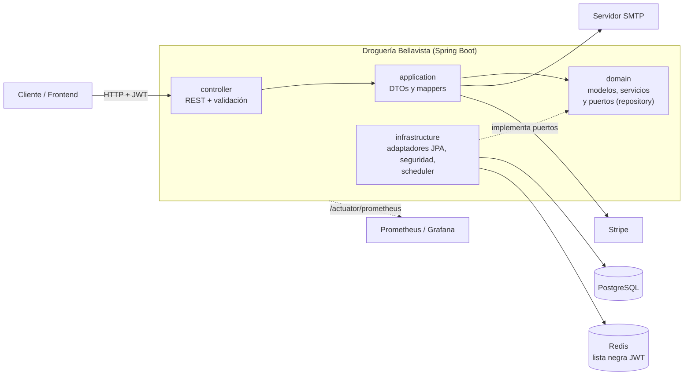

# 🏥 Droguería Bellavista — API REST

[](https://github.com/Dan17i/softwareDrogueria/actions/workflows/deploy.yml)
[](https://sonarcloud.io/summary/new_code?id=Dan17i_softwareDrogueria)
[](https://sonarcloud.io/summary/new_code?id=Dan17i_softwareDrogueria)


Backend de un sistema de gestión para droguerías: inventario, clientes, proveedores, órdenes, recepción de mercancía, pagos con Stripe y notificaciones. Construido con **Spring Boot 3 / Java 21** siguiendo una **arquitectura hexagonal** (puertos y adaptadores).

> **Documentación interactiva:** al ejecutar el proyecto, Swagger UI está en `http://localhost:8080/api/swagger-ui/index.html`.

---

## ✨ Características

- **Autenticación y roles:** JWT con cierre de sesión (lista negra en Redis) y cinco roles: `ADMIN`, `MANAGER`, `SALES`, `WAREHOUSE`, `USER`. Cada endpoint exige el rol que corresponde.
- **Inventario:** productos con stock mínimo, alertas automáticas de reposición y ajustes de stock con control de concurrencia.
- **Ventas y compras:** clientes con límite de crédito y saldo pendiente, proveedores, órdenes de compra y recepción de mercancía.
- **Pagos:** integración con Stripe (modo test).
- **Notificaciones** por rol y **correos transaccionales** (bienvenida, recuperación de contraseña) con plantillas HTML.
- **Seguridad:** límite de intentos por IP en login y recuperación de contraseña, Swagger y actuator cerrados por defecto, sin secretos en el repositorio.
- **Base de datos versionada** con Flyway.

## 🧰 Tecnologías

| Área | Tecnología |
|---|---|
| Lenguaje y framework | Java 21, Spring Boot 3.2.2 (Web, Security, Data JPA, Validation, Mail) |
| Persistencia | PostgreSQL 15, Flyway, Spring Data JPA |
| Caché y sesiones | Redis 7 (lista negra de tokens JWT) |
| Seguridad | Spring Security, JJWT 0.12 |
| Pagos | Stripe Java 24 |
| Documentación | SpringDoc OpenAPI 2.2 (Swagger UI) |
| Pruebas y calidad | JUnit 5, Mockito, Testcontainers, JaCoCo, SonarCloud |
| Observabilidad | Micrometer + Prometheus, Grafana |
| Infraestructura | Docker, Docker Compose, GitHub Actions, GHCR |

## 🏗️ Arquitectura

El dominio no depende de ningún framework: los controladores y los adaptadores de infraestructura dependen del dominio, nunca al revés.



```
src/main/java/com/drogueria/bellavista
├── controller/      Endpoints REST
├── application/     DTOs (records), mappers, casos de uso
├── domain/          Modelos, servicios de negocio y puertos (interfaces de repositorio)
├── infrastructure/  Adaptadores JPA, entidades, seguridad (JWT, rate limit), scheduler
├── config/          Seguridad, OpenAPI, Redis, async
└── exception/       Excepciones de negocio y manejo global de errores
```

## 🚀 Cómo ejecutarlo

### Requisitos

- Docker y Docker Compose v2
- (Opcional, sin Docker) Java 21 y Maven 3.8+

### Opción A — Demo completa con Docker Compose (recomendada)

Levanta la API, PostgreSQL, Redis y **Mailpit** (una bandeja local donde ves los correos que envía la app, sin proveedor SMTP real):

```bash
git clone https://github.com/Dan17i/softwareDrogueria.git
cd softwareDrogueria

cp .env.example .env        # edita DB_PASSWORD y APP_JWT_SECRET (mínimo 32 caracteres)

docker compose -f docker-compose.yml -f docker-compose.demo.yml up --build
```

| Servicio | URL |
|---|---|
| API | http://localhost:8080/api |
| Swagger UI | http://localhost:8080/api/swagger-ui/index.html |
| Mailpit (correos) | http://localhost:8025 |
| Health check | http://localhost:8080/api/actuator/health |

Para apagar y borrar los datos: `docker compose -f docker-compose.yml -f docker-compose.demo.yml down -v`.

### Opción B — Con un servidor SMTP real

Completa `MAIL_*` en `.env` con tu proveedor (Resend, Brevo, AWS SES…) y ejecuta solo `docker compose up --build`. Swagger queda cerrado salvo que pongas `APP_DOCS_PUBLIC=true`.

### Opción C — Desarrollo local con Maven

Necesitas un PostgreSQL local en el puerto `5433` (base `drogueria_bellavista`) y Redis en `6379`:

```bash
export DEV_DB_PASSWORD=tu_password_postgres_local
mvn spring-boot:run -Dspring-boot.run.profiles=dev
```

### Pruebas

```bash
mvn verify        # pruebas unitarias e integración (necesita Docker para Testcontainers) + informe JaCoCo
```

## ⚙️ Variables de entorno

Copia `.env.example` a `.env` (el archivo `.env` está ignorado por git).

| Variable | Obligatoria | Descripción |
|---|---|---|
| `DB_USER`, `DB_PASSWORD` | Sí | Credenciales de PostgreSQL |
| `APP_JWT_SECRET` | Sí | Clave de firma JWT, mínimo 32 caracteres (`openssl rand -base64 48`) |
| `MAIL_HOST`, `MAIL_PORT`, `MAIL_USERNAME`, `MAIL_PASSWORD`, `MAIL_FROM` | Sí | SMTP. `MAIL_FROM` debe estar verificado en tu proveedor |
| `STRIPE_SECRET_KEY`, `STRIPE_PUBLIC_KEY` | Para pagos | Claves de Stripe en modo test |
| `FRONTEND_URL` | No | URL del frontend (enlaces de correos). Por defecto `http://localhost:5173` |
| `APP_DOCS_PUBLIC` | No | `true` abre Swagger UI sin login (solo demos). Por defecto `false` |
| `DEV_DB_PASSWORD` | Solo perfil `dev` | Contraseña del PostgreSQL local |

Propiedades opcionales del límite de intentos: `app.rate-limit.enabled`, `login-max`, `forgot-password-max`, `register-max`.

## 📡 Ejemplos de endpoints

Todas las rutas cuelgan de `/api`. Hay más de 70 endpoints; el catálogo completo está en Swagger UI.

| Recurso | Ruta base | Roles |
|---|---|---|
| Autenticación | `/auth` | Público (`login`, `register`, recuperación) |
| Usuarios | `/users` | `ADMIN` |
| Productos | `/products` | Lectura: autenticado · Escritura: `ADMIN`, `WAREHOUSE` |
| Clientes | `/customers` | `ADMIN`, `MANAGER`, `SALES` |
| Proveedores | `/suppliers` | `ADMIN`, `MANAGER`, `WAREHOUSE` |
| Órdenes | `/orders` | `ADMIN`, `MANAGER`, `SALES` (+ lectura `WAREHOUSE`) |
| Recepciones | `/goods-receipts` | Lectura: `ADMIN`, `MANAGER`, `WAREHOUSE` · Escritura: `ADMIN`, `WAREHOUSE` |
| Notificaciones | `/api/notifications` (relativa al context path) | Por rol |

**1. Registrar un usuario**

```bash
curl -X POST http://localhost:8080/api/auth/register \
  -H "Content-Type: application/json" \
  -d '{"username":"demo","email":"demo@ejemplo.com","password":"Demo1234!","firstName":"Demo","lastName":"Usuario"}'
```

**2. Iniciar sesión** (devuelve `token`, `userId`, `username` y `role`)

```bash
curl -X POST http://localhost:8080/api/auth/login \
  -H "Content-Type: application/json" \
  -d '{"username":"demo","password":"Demo1234!"}'
```

**3. Dar rol de administrador al usuario de la demo** (los usuarios nuevos son `USER`; el primer `ADMIN` se asigna en la base de datos)

```bash
docker exec -it drogueria_db psql -U "$DB_USER" -d drogueria_bellavista \
  -c "UPDATE users SET role='ADMIN' WHERE username='demo';"
```

Vuelve a iniciar sesión para obtener un token con el rol nuevo.

**4. Crear un producto** (requiere `ADMIN` o `WAREHOUSE`)

```bash
curl -X POST http://localhost:8080/api/products \
  -H "Authorization: Bearer $TOKEN" -H "Content-Type: application/json" \
  -d '{"code":"P-001","name":"Acetaminofén 500 mg","description":"Caja x 100","price":12500.00,"stock":200,"minStock":20,"category":"ANALGESICO"}'
```

**5. Listar productos activos y los que necesitan reposición**

```bash
curl -H "Authorization: Bearer $TOKEN" "http://localhost:8080/api/products?active=true"
curl -H "Authorization: Bearer $TOKEN" http://localhost:8080/api/products/restock-needed
```

**6. Crear una orden** (el cliente, el proveedor y los productos deben existir)

```bash
curl -X POST http://localhost:8080/api/orders \
  -H "Authorization: Bearer $TOKEN" -H "Content-Type: application/json" \
  -d '{"customerId":1,"supplierId":1,"items":[{"productId":1,"quantity":10}],"notes":"Entrega prioritaria"}'
```

Más ejemplos listos para usar en [`http/`](http/) (REST Client) y en [`docs/Postman_Collection.json`](docs/Postman_Collection.json).

## ✅ Calidad

- **Pruebas:** más de 580 (unitarias, controladores, mappers e integración con PostgreSQL real vía Testcontainers).
- **SonarCloud:** análisis en cada push y Quality Gate sobre código nuevo (ver badges).
- **Migraciones:** `src/main/resources/db/migration`. Un test verifica que el esquema de Flyway coincide con las entidades JPA, así que un cambio de entidad sin migración rompe el build.
- **CI/CD:** GitHub Actions ejecuta las pruebas, publica la imagen en GHCR y, si hay servidor configurado (`DEPLOY_ENABLED`), despliega por SSH.

## 📚 Más documentación

La carpeta [`docs/`](docs/) incluye guías de inicio rápido, seguridad, pagos con Stripe, integración con el frontend, operaciones y el plan de gestión de la calidad del proyecto.

## 👤 Autor

**Daniel Jurado** — [github.com/Dan17i](https://github.com/Dan17i)
